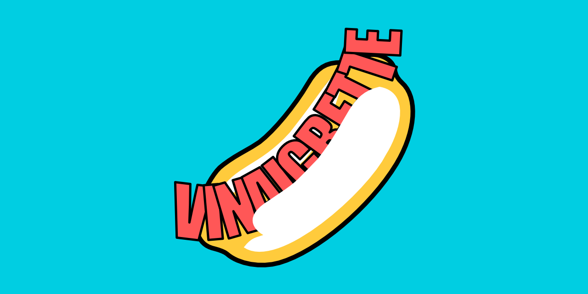

# vinaigrette-client



This project is a client for the [Vinaigrette Server](https://github.com/AmiralBl3ndic/Vinaigrette) project.

## Team

This client application is developed and maintained by :

- **Camille *[AmiralBl3ndic](https://github.com/AmiralBl3ndic)* Briand**
- **Elodie *[RookyRaccoon](https://github.com/RookyRaccoon)* Dehache**
- **Jules *[RaEace](https://github.com/RaEace)* Lagny**
- **Paul *[Paul-lepre](https://github.com/Paul-lepre)* Lepré**


## Project setup
```
yarn install
```

### Compiles and hot-reloads for development
```
yarn serve
```

### Compiles and minifies for production
```
yarn build
```

### Lints and fixes files
```
yarn lint
```
